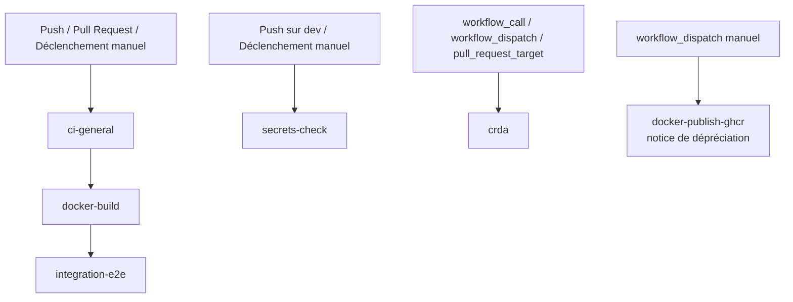
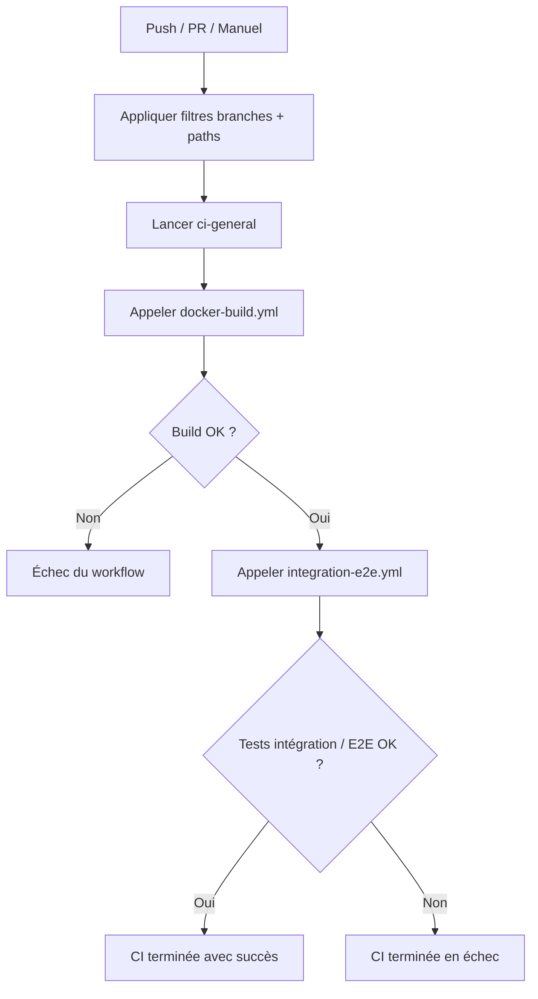
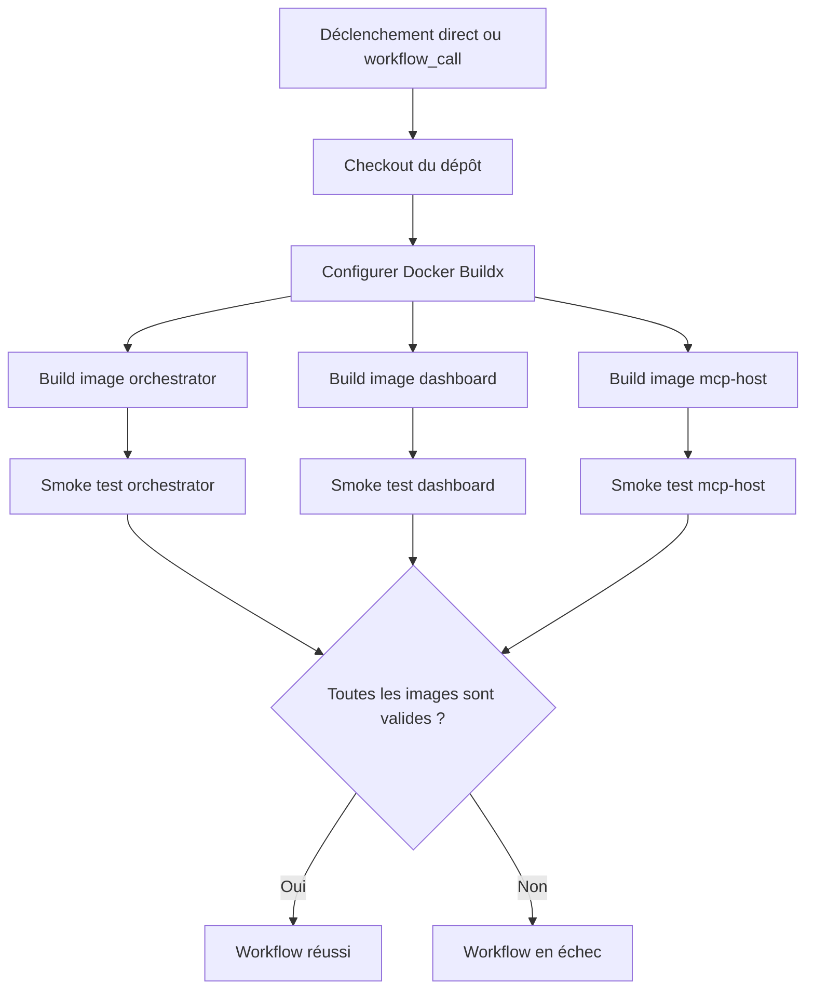
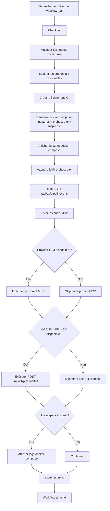
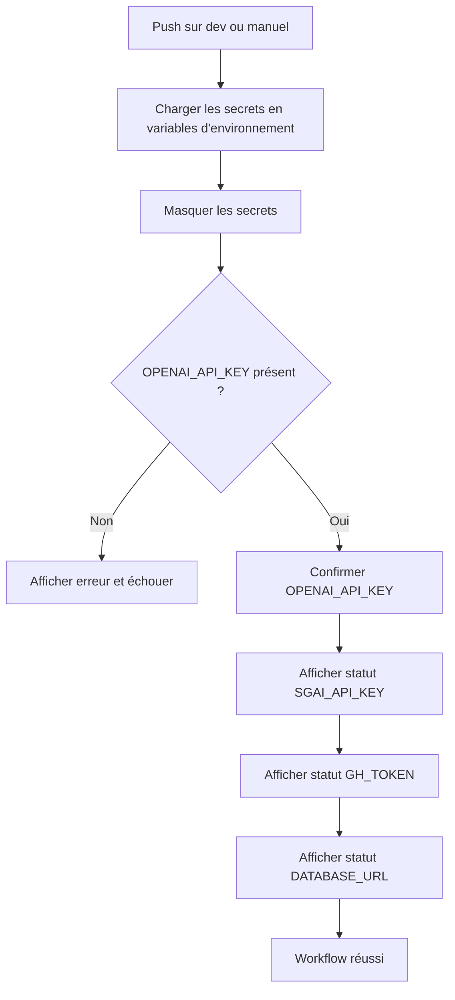
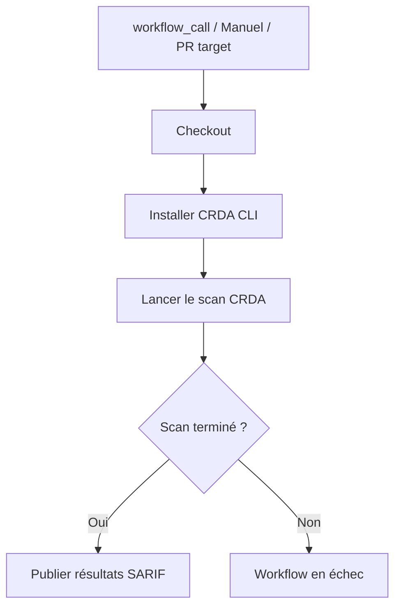
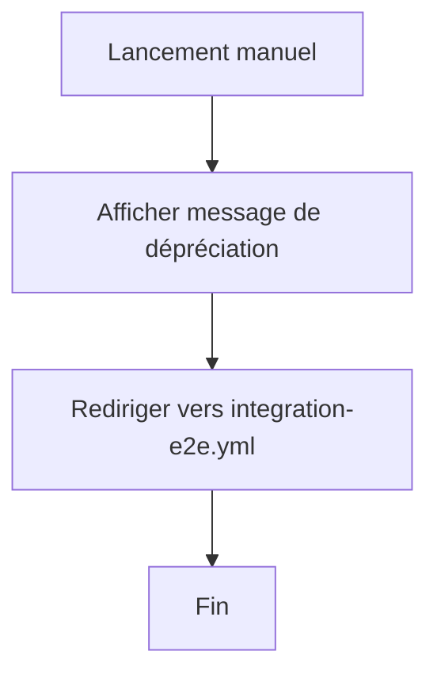

# Documentation des workflows GitHub Actions

Ce document décrit les workflows GitHub Actions du dépôt, leur rôle, leurs déclencheurs, les secrets utilisés, ainsi qu’un diagramme d’activité pour chacun.

## Vue d’ensemble

Les workflows actuellement présents sont :

- `.github/workflows/ci-general.yml`
- `.github/workflows/docker-build.yml`
- `.github/workflows/integration-e2e.yml`
- `.github/workflows/secrets-check.yml`
- `.github/workflows/crda.yml`
- `.github/workflows/docker-publish-ghcr.yml` *(workflow déprécié, conservé uniquement comme notice manuelle)*

## Relations entre les workflows

---

## 1. `.github/workflows/ci-general.yml`

### Rôle

`ci-general` est le workflow principal du projet.

Il ne contient pas de logique de build ou de test directement.  
Il sert à **orchestrer** les workflows réutilisables suivants :

1. `docker-build.yml`
2. `integration-e2e.yml`

### Déclencheurs

- `push` sur `main` et `master`
- `pull_request` sur `main` et `master`
- `workflow_dispatch`

### Filtres de chemins

- `app/**`
- `dashboard/**`
- `mcp_host/**`
- `data/**`
- `requirements.txt`
- `docker-compose.yml`
- `.github/workflows/ci-general.yml`
- `.github/workflows/docker-build.yml`
- `.github/workflows/integration-e2e.yml`
- `.github/workflows/secrets-check.yml`

### Fonctionnement

- le job `docker-build` appelle le workflow réutilisable `.github/workflows/docker-build.yml`
- si ce job réussit, le job `integration-e2e` appelle `.github/workflows/integration-e2e.yml`

### Secrets

- `secrets: inherit`
- `ci-general` ne consomme pas les secrets directement
- il transmet simplement les secrets aux workflows appelés

### Permissions

- `contents: read`

### Diagramme d’activité

---

## 2. `.github/workflows/docker-build.yml`

### Rôle

Ce workflow construit et valide les images Docker du projet.

Il vérifie que les images suivantes peuvent être générées correctement :

- `orchestrator`
- `dashboard`
- `mcp-host`

### Déclencheurs

- `workflow_call`
- `workflow_dispatch`
- `push` sur `main` et `master`
- `pull_request`

### Filtres de chemins

- `app/**`
- `dashboard/**`
- `mcp_host/**`
- `requirements.txt`
- `docker-compose.yml`
- `.github/workflows/docker-build.yml`

### Images construites

- `orchestrator` → `app/Dockerfile`
- `dashboard` → `dashboard/Dockerfile`
- `mcp-host` → `mcp_host/Dockerfile`

### Ce que fait le workflow

Pour chaque image :

1. checkout du dépôt
2. configuration de Docker Buildx
3. build de l’image
4. chargement local de l’image dans le runner
5. smoke test via `docker image inspect`

### Publication

Aucune publication n’est effectuée :

- `push: false`
- aucune publication GHCR
- usage uniquement CI / validation

### Secrets

Aucun secret requis.

### Permissions

- `contents: read`

### Diagramme d’activité

---

## 3. `.github/workflows/integration-e2e.yml`

### Rôle

Ce workflow exécute les tests d’intégration et les tests E2E du stack Docker/MCP.

Il valide notamment :

- le démarrage du stack Docker Compose
- la connectivité de l’orchestrateur FastAPI
- les routes pipeline
- le host MCP
- un prompt MCP
- un use case complet de génération de lettre de motivation avec un CV réel et une offre d’emploi externe

### Déclencheurs

- `workflow_call`
- `workflow_dispatch`
- `push` sur `main` et `master`
- `pull_request` sur `main` et `master`

### Filtres de chemins

- `app/**`
- `dashboard/**`
- `mcp_host/**`
- `data/**`
- `requirements.txt`
- `docker-compose.yml`
- `.github/workflows/ci-general.yml`
- `.github/workflows/docker-build.yml`
- `.github/workflows/integration-e2e.yml`
- `.github/workflows/secrets-check.yml`

### Secrets utilisés

#### Secrets optionnels ou conditionnels

- `OPENAI_API_KEY`
  - permet le test complet `/api/v1/pipeline/full`
  - permet aussi le test de prompt MCP côté OpenAI
- `ANTHROPIC_API_KEY`
  - fournisseur alternatif pour le prompt MCP
- `SGAI_API_KEY`
  - optionnel, utile pour le scraping si disponible

### Variables importantes

- `CV_UPLOAD_DIR`
- `E2E_JOB_URL`
- `DATABASE_URL`
- `COMPOSE_PROFILES=mcp`

### Ce que fait le workflow

1. checkout du dépôt
2. masquage des secrets présents
3. évaluation des credentials disponibles
4. création d’un fichier `.env` CI pour Docker Compose
5. démarrage de :
   - `postgres`
   - `orchestrator`
   - `mcp-host`
6. attente de disponibilité de l’API orchestrator
7. test `GET /api/v1/pipeline/runs`
8. test `python -m mcp_host.main --list-tools`
9. test d’un prompt MCP si un provider est disponible
10. test E2E `POST /api/v1/pipeline/full` si `OPENAI_API_KEY` est disponible
11. logs Docker Compose en cas d’échec
12. arrêt et nettoyage du stack

### Use case E2E couvert

Le test E2E complet utilise :

- le CV : `data/cv_upload.pdf`
- une offre d’emploi externe publique via `E2E_JOB_URL`

Le but est de valider le scénario :

- lecture du CV
- récupération de l’offre
- génération d’une lettre de motivation
- production d’un résultat pipeline complet

### Comportement adaptatif

Le workflow est volontairement tolérant :

- si aucun provider LLM n’est disponible, le test prompt MCP est skip
- si `OPENAI_API_KEY` manque, le test pipeline complet est skip
- les autres tests de connectivité restent exécutés

### Permissions

- `contents: read`

### Diagramme d’activité

---

## 4. `.github/workflows/secrets-check.yml`

### Rôle

`secrets-check` est un workflow simple de vérification de configuration.

Il sert à confirmer la présence de certains secrets utiles au projet.

### Déclencheurs

- `push` sur `dev`
- `workflow_dispatch`

### Secrets contrôlés

- `OPENAI_API_KEY`
- `SGAI_API_KEY`
- `GH_TOKEN`
- `DATABASE_URL`

### Règles

- `OPENAI_API_KEY` est traité comme requis dans ce workflow
- les autres secrets sont signalés comme optionnels ou contextuels

### Ce que fait le workflow

1. masque les secrets présents
2. échoue si `OPENAI_API_KEY` manque
3. affiche l’état des autres secrets

### Permissions

- `contents: read`

### Diagramme d’activité

---

## 5. `.github/workflows/crda.yml`

### Rôle

`crda.yml` est un workflow dédié au scan de sécurité et à l’analyse des dépendances avec Red Hat CodeReady Dependency Analytics.

Il est séparé de la CI principale.

### Déclencheurs

- `workflow_call`
- `workflow_dispatch`
- `pull_request_target` vers `master`

### Secrets possibles

- `CRDA_KEY`
- `SNYK_TOKEN`

### Ce que fait le workflow

1. checkout du dépôt
2. installation de l’outil CRDA
3. exécution du scan
4. publication éventuelle des résultats SARIF

### Permissions

Au niveau du job :

- `contents: read`
- `security-events: write`

### Diagramme d’activité

---

## 6. `.github/workflows/docker-publish-ghcr.yml` *(déprécié)*

### Rôle

Ce fichier est conservé uniquement pour éviter la confusion avec l’ancien nom historique.

Il ne publie rien, ne build rien, et ne fait plus partie du pipeline principal.

### Déclencheur

- `workflow_dispatch` uniquement

### Ce qu’il fait

Il affiche simplement un message indiquant que :

- le workflow est déprécié
- il faut utiliser `.github/workflows/integration-e2e.yml`
- aucune publication GHCR n’est réalisée dans ce dépôt

### Diagramme d’activité

---

## Tableau récapitulatif des secrets

| Secret | Workflows concernés | Statut | Usage |
|---|---|---|---|
| `OPENAI_API_KEY` | `integration-e2e.yml`, `secrets-check.yml` | Requis selon scénario | Prompt MCP OpenAI, test E2E complet, contrôle de configuration |
| `ANTHROPIC_API_KEY` | `integration-e2e.yml` | Optionnel | Provider alternatif pour le prompt MCP |
| `SGAI_API_KEY` | `integration-e2e.yml`, `secrets-check.yml` | Optionnel | Scraping / enrichissement selon scénario |
| `GH_TOKEN` | `secrets-check.yml` | Optionnel | Automatisations GitHub |
| `DATABASE_URL` | `secrets-check.yml` | Optionnel dans ce workflow | Vérification de configuration |
| `CRDA_KEY` | `crda.yml` | Optionnel | Authentification CRDA |
| `SNYK_TOKEN` | `crda.yml` | Optionnel | Authentification alternative prévue |

---

## Enchaînement recommandé

L’ordre logique de la CI est :

1. `ci-general.yml`
2. `docker-build.yml`
3. `integration-e2e.yml`

Les autres workflows ont des rôles annexes :

- `secrets-check.yml` : contrôle ciblé des secrets
- `crda.yml` : sécurité / dépendances
- `docker-publish-ghcr.yml` : notice de dépréciation uniquement

## Résumé opérationnel

- `ci-general.yml` = point d’entrée principal
- `docker-build.yml` = validation des images Docker
- `integration-e2e.yml` = tests d’intégration, MCP et use case lettre de motivation
- `secrets-check.yml` = audit simple des secrets
- `crda.yml` = scan de sécurité
- `docker-publish-ghcr.yml` = workflow historique déprécié, sans publication GHCR
